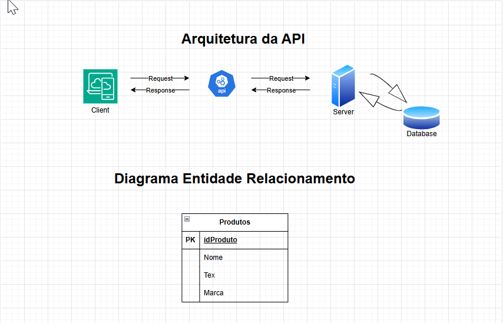

# Requisitos da API de Crochê

## Funcionais

1. **Gerenciamento de Produtos**
   - A API deve permitir a listagem de todos os produtos de croche.
   - Campos obrigatórios: nome, tex, marca.
   - A API deve ser listada em ordem alfabética.
   - A API deve permitir a busca de produtos por nome.
   - A API deve permitir a busca de produtos por marca.
   - A API deve permitir a busca de produtos por tex.
   - A API deve permitir a busca de produtos por range de tex.

## Não Funcionais

1. **Segurança**
   - A API deve utilizar HTTPS para comunicação segura.

2. **Desempenho**
   - A API deve ser capaz de suportar até 1000 requisições por segundo.

3. **Documentação**
   - A API deve ter uma documentação clara e detalhada, preferencialmente utilizando Swagger.

4. **Logs e Monitoramento**
   - A API deve implementar logs para auditoria e monitoramento de erros.

## Tecnologias

1. **Linguagem de Programação**
   - A API deve ser desenvolvida em Node.js.

2. **Banco de Dados**
   - A API deve utilizar um banco de dados relacional.

3. **Hospedagem**
   - A API deve ser hospedada em um serviço de nuvem.

## Prazos

1. **Desenvolvimento**
   - O desenvolvimento da API deve ser concluído em 3 meses.

2. **Testes**
   - Os testes devem ser realizados em 1 mês.

3. **Implantação**
   - A implantação deve ser realizada em 1 semana após a conclusão dos testes.

